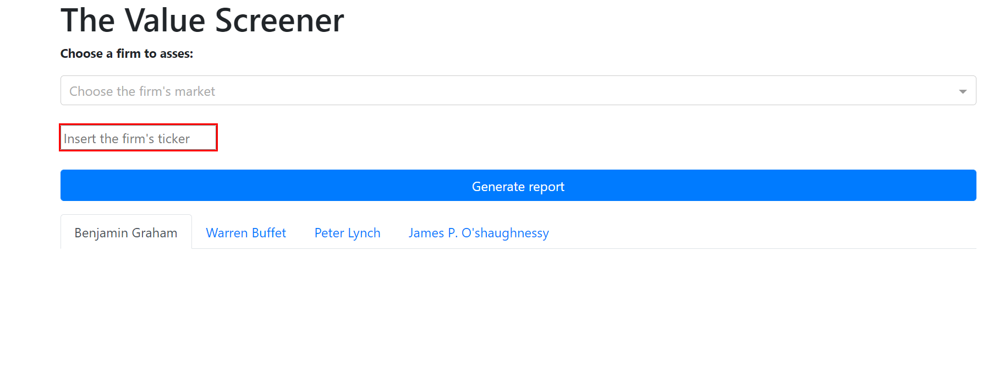
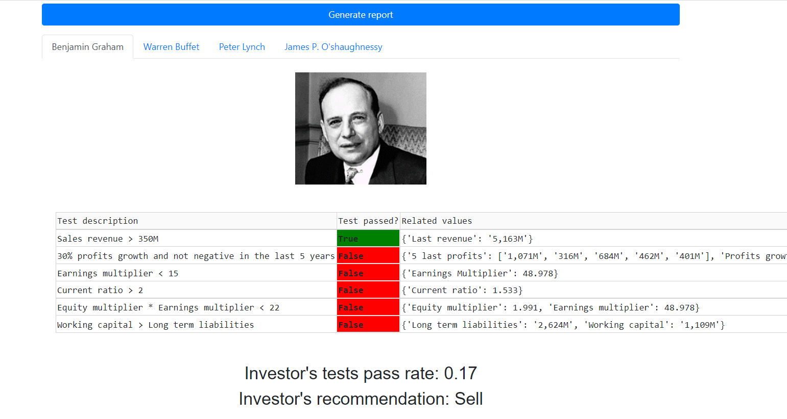

# value_screener
## General
This project was created out of personal interest in a data oriented approach of the stock market. The goal was to create
    an investing recommendation tool designed for our personal needs.

## Overview
This module uses the SimFin Python API to retrieve firms' last annual financial
    statements (income statement, balance sheet and cash flow statement) and some basic data about the stock price. Using 
    this data, it allows the calculation of financial metrics and relations, to help decide whether the firm's stock
    should be bought, sold, or held. To summarize the calculations, it allows generating a conclusive report. The metrics
    and relations in the report are all based on benchmarks that were defined by famous investors: Benjamin Graham,
    Warren Buffet, Peter Lynch and James P O'shaughnessy.
 **Important note #1** - The SimFin API's free version supplies financial reports with a delay of 1 year.
    Using this project with the free API version might return false or stale results.
 **Important note #2** - For now, this module only analyzes annual reports. In the future, we might add features to
    support analyzing the quarterly reports.
 **Important note #3** - The markets that are currently (September 2021) supported by the SimFin API: US('us'), Canada
    ('ca'), China ('cn'), Germany ('de'), Singapore('sg'), Italy ('it'). Before using this project, make sure that the
    stock in which you are interested is included in the SimFin dataset.

## Usage
The Firm class holds all the attributes and methods required for the analysis.
    An instance of this class represents a publicly traded firm. Once instantiated, the object reads the firm's last 
    annual financial statements (income statement, balance sheet and cash flow statement), and some basic data about the
    firm's stock value from Simfin's API. The API key should be stored in an environment variable named SIMFIN_KEY.
 **To analyze a firm, we recommend using the generate_firm_report method of the Firm class**. All the rest of the methods in this
    class are being called under the hood to create the report. The generated report is a Python Pandas DataFrame object.
    Each row in the dataframe is a benchmark used by one of the famous investors to asses whether a stock is an
    attractive investment. The dataframe contains a written explanation on the benchmark, all the related values that
    were included in the calculation, and a bottom-line recommendation by the famous investor's theory.
 In case that you want to use some of the other methods separately, note the naming conventions:
 1. Methods that start with the word 'get' are used to calculate a ratio or a metric.
 2. Methods that end with the word 'test' are used to check if the stock is attractive according to a specific benchmark,
    and will return a boolean value.

## Usage example
    # Instantiate a class instance
    Agilent_Technologies = Firm(ticker='A', market='us')
    # Generate a detailed report
    Agilent_report = Agilent_Technologies.generate_firm_report()

The generated report:

|    | investor               | test_id                               | description                                                                                                                                                                                                              | test_passed   | related_values                                                                                                 |   investor_test_pass_rate | investor_recommendation   |
|---:|:-----------------------|:--------------------------------------|:-------------------------------------------------------------------------------------------------------------------------------------------------------------------------------------------------------------------------|:--------------|:---------------------------------------------------------------------------------------------------------------|--------------------------:|:--------------------------|
|  0 | Benjamin Graham        | last_revenue                          | Sales revenue > 350M                                                                                                                                                                                                     | True          | {'Last revenue': '5,163M'}                                                                                     |                  0.166667 | sell                      |
|  1 | Benjamin Graham        | profits_growth                        | 30% profits growth and not negative in the last 5 years                                                                                                                                                                  | False         | {'5 last profits': ['1,071M', '316M', '684M', '462M', '401M'], 'Profits growth last four years': 0.284}        |                  0.166667 | sell                      |
|  2 | Benjamin Graham        | earnings_multiplier                   | Earnings multiplier < 15                                                                                                                                                                                                 | False         | {'Earnings Multiplier': 48.978}                                                                                |                  0.166667 | sell                      |
|  3 | Benjamin Graham        | current_ratio                         | Current ratio > 2                                                                                                                                                                                                        | False         | {'Current ratio': 1.533}                                                                                       |                  0.166667 | sell                      |
|  4 | Benjamin Graham        | equity_earnings                       | Equity multiplier * Earnings multiplier < 22                                                                                                                                                                             | False         | {'Equity multiplier': 1.991, 'Earnings multiplier': 48.978}                                                    |                  0.166667 | sell                      |
|  5 | Benjamin Graham        | working_capital_long_term_liabilities | Working capital > Long term liabilities                                                                                                                                                                                  | False         | {'Long term liabilities': '2,624M', 'Working capital': '1,109M'}                                               |                  0.166667 | sell                      |
|  6 | Warren Buffet          | consistent_profits_growth             | EPS is constantly growing in the last 5 years, and is not negative                                                                                                                                                       | False         | {'Last 5 years common profit': ['1,071M', '316M', '684M', '462M', '401M']}                                     |                  0.333333 | sell                      |
|  7 | Warren Buffet          | net_income_long_liabilities           | Cumulative total net income of last 5 years > Long term liabilities                                                                                                                                                      | True          | {'Cumulative net income of 5 years': '2,934M', 'Long term liabilities': '2,624M'}                              |                  0.333333 | sell                      |
|  8 | Warren Buffet          | roa                                   | ROA > 12%                                                                                                                                                                                                                | False         | {'ROA': 0.113}                                                                                                 |                  0.333333 | sell                      |
|  9 | Warren Buffet          | roe_5_years                           | ROE of last 5 years > 15%                                                                                                                                                                                                | False         | {'Average ROE of last 5 years': 0.128}                                                                         |                  0.333333 | sell                      |
| 10 | Warren Buffet          | positive_fcff                         | Free cash flow > 0                                                                                                                                                                                                       | True          | {'FCFF': '2,637M'}                                                                                             |                  0.333333 | sell                      |
| 11 | Warren Buffet          | profits_growth_to_surplus             | Last year's profits growth/Retained earnings > 12%                                                                                                                                                                       | False         | {"Last year's net income growth": '755M', 'Retained earnings': -18000000.0}                                    |                  0.333333 | sell                      |
| 12 | Peter Lynch            | peg_ratio                             | PEG ratio < 1                                                                                                                                                                                                            | False         | {'PEG ratio': 78.874}                                                                                          |                  0.833333 | buy                       |
| 13 | Peter Lynch            | debt_equity_ratio                     | Debt/Equity ratio < 0.8                                                                                                                                                                                                  | True          | {'Debt to equity ratio': 0.216, 'Shareholders equity': '4,748M', 'Net debt': '1,025M'}                         |                  0.833333 | buy                       |
| 14 | Peter Lynch            | lynch_profits_growth                  | ((5 years average profit growth > 0.2) AND (Last year profit growth > 0.2)) Or ((5 years average profit growth > 0.1) AND (Last year profit growth > 0.1) AND (Last year profit growth > 5 years average profit growth)) | True          | {'Average profits growth rate of the last 5 years': 0.621, "last year's profits growth rate": 2.389}           |                  0.833333 | buy                       |
| 15 | Peter Lynch            | inventories_revenue_growth            | Inventories/Revenue growth this year < 0.05                                                                                                                                                                              | True          | {'Inventories to revenue ratios of last 2 years': [0.132, 0.13], 'Inventories to revenue ratio growth': 0.013} |                  0.833333 | buy                       |
| 16 | Peter Lynch            | positive_last_two_profits             | Last two years profits > 0                                                                                                                                                                                               | True          | {"Last two years' profits": ['1,071M', '316M']}                                                                |                  0.833333 | buy                       |
| 17 | Peter Lynch            | lynch_profit_revenue                  | ((5 years average profit growth > 0.2) AND (Revenue > 1B)) Or ((5 years' profit growth > 0) AND (Revenue > 1.9B))                                                                                                        | True          | {"Last 5 years' average profits growth rate": 0.621, 'Last revenue': '5,163M'}                                 |                  0.833333 | buy                       |
| 18 | James P. O'shaughnessy | market_cap                            | Market cap > 150M                                                                                                                                                                                                        | True          | {'Market cap': '52,456M'}                                                                                      |                  0.25     | sell                      |
| 19 | James P. O'shaughnessy | market_cap_revenue                    | Market cap/Revenue < 1.5                                                                                                                                                                                                 | False         | {'Market cap': '52,456M', 'Revenue': '5,163M', 'Market cap to revenue ratio': 10.16}                           |                  0.25     | sell                      |
| 20 | James P. O'shaughnessy | consistent_profits_growth             | EPS is constantly growing in the last 5 years, and is not negative                                                                                                                                                       | False         | {'Last 5 years common profit': ['1,071M', '316M', '684M', '462M', '401M']}                                     |                  0.25     | sell                      |
| 21 | James P. O'shaughnessy | market_cap_revenue_market_comparison  | (Market cap/Revenue) < (Market's market cap/Revenue)                                                                                                                                                                     | False         | {'Market cap to revenue ratio': 10.16, 'Market cap to revenue entire market ratio': 2.28}                      |                  0.25     | sell                      |

Once instantiating the class, the whole financial reports dataset (includes all firms) is being read to your local disk.
    In the next time you call it, the data will be read from disk instead of an API call.

## Plotly Dash application
In order to simplify the usage, we created a very basic application using Plotly Dash. All you have to do is insert the
    firm's ticker and choose the appropriate market.
  
    
  
    
